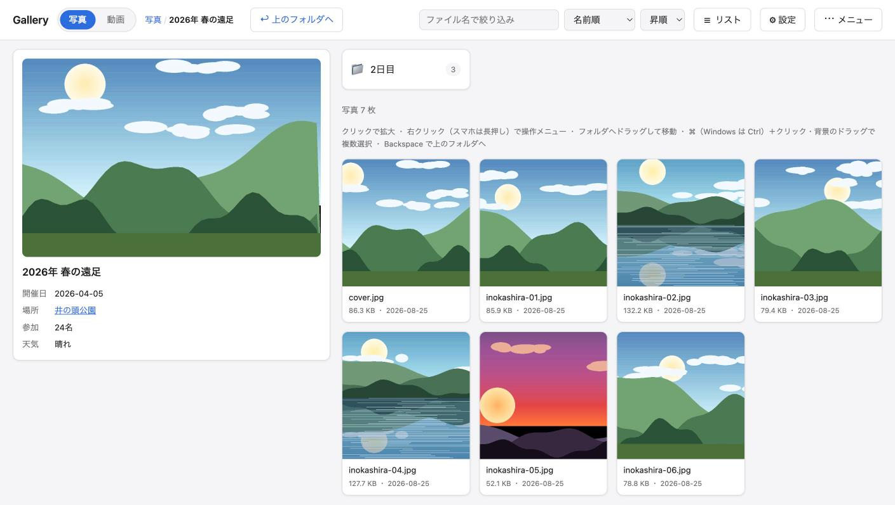
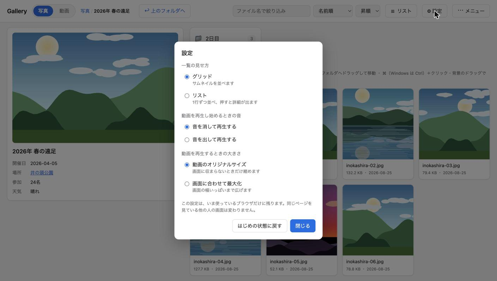
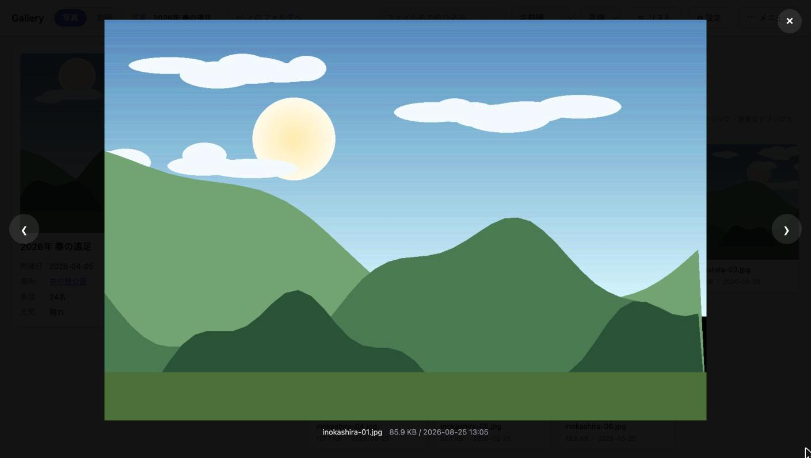
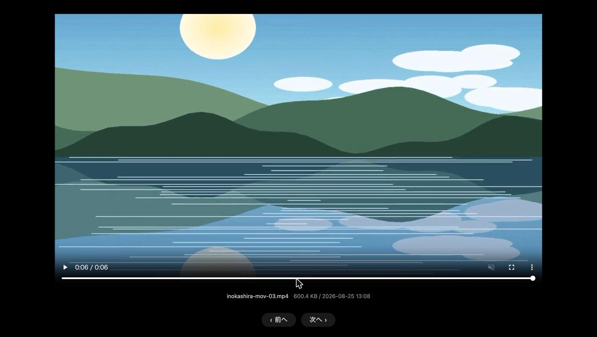
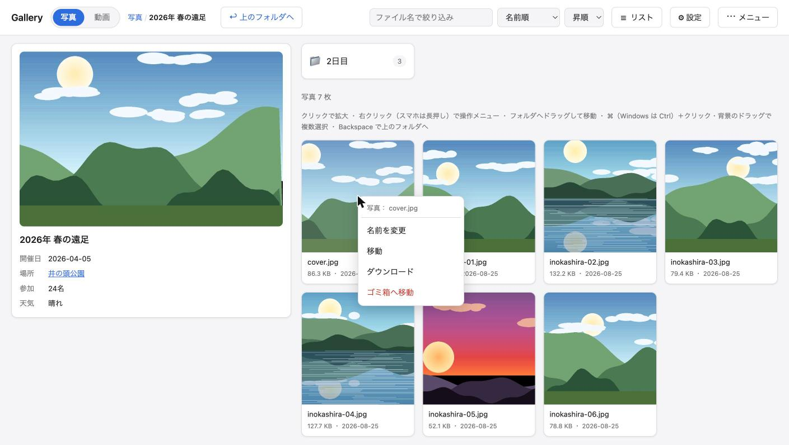

# Media Library

サーバー上の写真・動画を、ブラウザから一覧・再生するためのPHPツールです。
写真は `photos/`、動画は `movies/` に置き、画面上部のタブで切り替えます。

閲覧できる人を限定したいときは、Basic認証をかけられます。
既定では無効なので、必要なときだけ設定してください（→「Basic認証をかける」）。



## できること

- 写真と動画のタブ切り替え（`photos/` と `movies/`）
- サムネイルのグリッド表示（写真はクリックで拡大、動画はクリックで再生）
- 1行ずつ並べるリスト表示（右上のボタンで切り替え）
  - 項目をクリックすると、グリッドと同じように拡大表示・再生
- プロパティの表示（右クリック、スマホは長押しのメニューから）
  - サムネイル・ファイル名・種類・サイズ・更新日時・場所を画面全体に出す
  - グリッド・リストのどちらでも、また閲覧のみの設定でも使える
- 動画の再生（ブラウザ内蔵のプレーヤー。再生・一時停止・シーク・全画面・音量）
- サブフォルダの階層移動（パンくずリスト付き）
- 名前順／更新日時順／サイズ順の並び替え、昇順・降順の切り替え
- ファイル名での絞り込み
- キーボード操作
  - `←` `→` … 拡大表示中に前後の写真へ
  - `Esc` … 拡大表示・動画ビューワーを閉じる
  - `Backspace` … 上のフォルダへ移動（拡大表示中は閉じる）
- スマホでのスワイプ操作（写真のみ）
- 件数が多いフォルダのページ送り
  - 枚数・ページ番号とまとめて一覧の上に置き、ヘッダーの下に貼り付く
  - どこまでスクロールしても、同じ場所でページを切り替えられる
- 動画の見え方を画面から切り替える設定（右上の「⚙ 設定」）
  - 再生し始めるときに音を消すかどうか
  - 再生するときの大きさ（動画のオリジナルサイズ／画面に合わせて最大化）
- フォルダに `info.json` を置くと、そのフォルダ情報を一覧の横に表示（→「フォルダ情報を付ける」）
  - フォルダ情報があるときは、枚数とページ送りもその下にそろえて出る
  - タイトル・サムネイル・「見出し : 中身」の一覧を表示し、右クリックから画面上で編集できる
  - サムネイルに `random` と書くと、そのフォルダ以下の画像から毎回1枚を選ぶ
- 写真・動画・フォルダの整理（右クリック、スマホは長押しでメニュー）
  - プロパティの表示
  - 名前の変更
  - 別のフォルダへの移動（複数まとめて可、ドラッグ＆ドロップにも対応）
  - まとめて選ぶ（`⌘`／`Ctrl` ＋クリック、`Shift` ＋クリック、枠で囲むドラッグ、`Shift` ＋矢印キー）
  - ゴミ箱への移動（すぐには消さず `photos/.trash/`・`movies/.trash/` へ退避）
  - 新しいフォルダの作成
  - フォルダ情報（`info.json`）の作成・編集
  - `config.php` の `read_only` で、整理機能をまとめてオフにできる
- ドラッグ＆ドロップでの取り込み（→「ドラッグ＆ドロップで取り込む」）
  - パソコンから写真・動画を落とすと、開いているフォルダに入る
  - フォルダごと落とすと、中の構成をそのまま作り直す
  - ファイルを小さく切って送るので、共有サーバーの上限に左右されず大きな動画も上げられる

## 動作環境

- PHP 7.4 以上（PHP 8.3 で動作確認済み）
- Apache（`.htaccess` が有効であること）
- 整理機能を使う場合は、`photos/` `movies/` に書き込み権限があること
- Basic認証を使う場合は、Apache の `mod_auth_basic` が有効であること
  （多くのレンタルサーバーでは既定で有効です）
- 動画の再生には、サーバーが範囲リクエスト（HTTP Range）に応じること
  （Apache の静的ファイル配信では既定で有効です。シークができない場合はここを確認してください）
- 整理機能はCSRF対策にセッションを使うため、ブラウザ側でCookieが有効であること
  （閲覧するだけならCookieは不要です）

## インストール

Apache が動くサーバーにファイルを置けば、そのまま動きます。データベースも外部ライブラリも使いません。

以下は、`https://example.com/` に `/home/user/www/media-library` を割り当てた場合の例です。
ドメインとパスは、自分の環境に読み替えてください。

| | 例 |
| --- | --- |
| 公開URL | `https://example.com/` |
| 設置パス | `/home/user/www/media-library/` |
| 写真フォルダ | `/home/user/www/media-library/photos/` |
| 動画フォルダ | `/home/user/www/media-library/movies/` |
| SSH接続先 | `user@example.com` |

### 1. ファイルを配置する

リポジトリを取得し、中身をサーバーの設置先（例: `/home/user/www/media-library/`）にアップロードします。

```
git clone https://github.com/<ユーザー名>/media-library.git
```

ZIPでダウンロードして展開しても構いません。

次に、同梱の `.htaccess.example` を `.htaccess` という名前でコピーします。
Apache の設定は環境ごとに書き換えることがあるため、見本ファイルとして配布しています。

```
cp .htaccess.example .htaccess
```

そのままでも動きます。書き換えが必要なのは、Basic認証を使う場合（→手順4）と、
HTTPSリダイレクトを有効にする場合だけです。

`.htaccess` は先頭がドットで始まる隠しファイルなので、FTPクライアントの設定で「隠しファイルを表示する」を
有効にしておかないと転送されないことがあります。

### 2. 写真と動画を置く

写真は `photos/`、動画は `movies/` にアップロードします。
サブフォルダを作れば、そのまま階層として表示されます。

```
photos/
├── 2026-01_旅行/
│   ├── kyoto-01.jpg
│   └── 2日目/
│       └── day2-a.jpg
└── landscape/
    └── mountain.jpg

movies/
└── 2026-01_旅行/
    ├── kyoto-01.mp4
    └── kyoto-02.mp4
```

動画は、ブラウザがそのまま再生できる形式にしてください（`mp4` / `m4v` / `mov` / `webm` / `ogv`）。
`mp4`（H.264 + AAC）がもっとも確実です。デジタルカメラやスマートフォンの `mov` は、
中身によっては再生できないことがあります。その場合は `mp4` に変換してからアップロードしてください。

### 3. ブラウザで開く

`https://example.com/`（設置したURL）にアクセスすると、一覧が表示されます。
ここまでで基本的な設置は完了です。

> **HTTPSでアクセスできるようにしておくことをおすすめします**
> サーバーの管理画面などからSSL証明書（Let's Encrypt など）を有効にし、発行が終わったら
> `.htaccess` の末尾にあるHTTPSリダイレクトのコメントを外してください。
> 次のBasic認証を使う場合は、HTTPSが**必須**です（理由は下に書いています）。

### 4. Basic認証をかける（任意）

このツール自体はログイン機能を持ちません。URLを知っている人なら誰でも見られる状態です。
閲覧できる人を限定したいときは、Apache の Basic認証をかけてください。

**見本ファイル（`.htaccess.example`）では、Basic認証は無効にしてあります。**
使う場合だけ、以下の 4-1 と 4-2 の両方を行ってください。

#### 4-1. `.htpasswd` を作る

以下のいずれかの方法で作成し、`/home/user/www/media-library/.htpasswd` として設置します。

**A. サーバーにSSHでログインできる場合**

```
htpasswd -c /home/user/www/media-library/.htpasswd ユーザー名
```

パスワードの入力を2回求められます。ユーザーを追加するときは `-c`（新規作成）を外して実行してください。

**B. 手元のPCで作る場合**

```
htpasswd -nbB ユーザー名 パスワード
```

出力された1行を `.htpasswd` という名前のテキストファイルに保存し、アップロードします。

**C. 同梱のスクリプトを使う場合**

```
php make-htpasswd.php ユーザー名 パスワード > .htpasswd
```

`htpasswd` コマンドが手元にない場合に使えます。このスクリプトはコマンドラインからのみ実行でき、
ブラウザからアクセスしても動きません。

> **うまく認証できないとき**
> 上記はいずれも bcrypt 形式のハッシュを生成します。Apache 2.4 以降なら問題ありませんが、
> 古いサーバーで認証が通らない場合は、サーバーの管理画面（cPanelなど）が持つ
> 「ディレクトリのパスワード保護」機能で `.htpasswd` を生成してください。

#### 4-2. `.htaccess` の認証設定を有効にする

手順1でコピーした `.htaccess` の先頭にある次の4行は、見本の時点ではコメント（`#`）になっています。
**行頭の `#` を外し**、`AuthUserFile` を**サーバー上の絶対パス**に書き換えてください。

```
#AuthType Basic                                  ← コピーした直後（無効）
#AuthName "Media Library"
#AuthUserFile /path/to/media-library/.htpasswd
#Require valid-user
```

```
AuthType Basic                                        ← 有効にした状態
AuthName "Media Library"
AuthUserFile /home/user/www/media-library/.htpasswd    ← 実際のパスに書き換える
Require valid-user
```

パスを書き換えないまま有効にすると認証が動かず、サーバーエラー（500）になります。

絶対パスがわからないときは、以下の内容の `path.php` を一時的に置いてブラウザでアクセスすると確認できます
（**確認したら必ず削除してください**）。

```php
<?php echo __DIR__;
```

設定できたら、もう一度 `https://example.com/` を開きます。ユーザー名とパスワードを求められれば成功です。

> **必ずHTTPSでアクセスしてください**
> Basic認証はユーザー名とパスワードをほぼそのままの形で送信するため、`http://` で使うと
> 通信経路上で読み取られる可能性があります。SSL証明書を有効にし、`.htaccess` の
> 末尾にあるHTTPSリダイレクトのコメントを外してから使ってください。

### 5. サーバーへの反映（Makefile）（任意）

2回目以降の更新は、`make` コマンドで差分だけを転送できます。使わなくても運用できます。

接続先はサーバーごとに違うため、`Makefile` はリポジトリに含めていません。
`.htaccess` と同じく、同梱の `Makefile.example` をコピーして作成してください。

```
cp Makefile.example Makefile
```

コピーした `Makefile` の先頭にある2行を、自分のサーバーに合わせて書き換えます。

```
SSH_HOST   := user@example.com
REMOTE_DIR := /home/user/www/media-library
```

`Makefile` は `.htaccess` とともに `.gitignore` に入れてあるので、書き換えた接続先が
リポジトリに入ることはありません。

#### コマンド一覧

```
make help             使えるコマンドの一覧を表示
make lint             PHPの構文チェック
make serve            ローカルで動作確認（http://127.0.0.1:8765/）

make diff             サーバーとの差分を確認（転送はしない）
make deploy           サーバーへ反映
make deploy-media     photos/ movies/ の中身もサーバーへ転送する

make remote-init      サーバー側に photos/ movies/ を作る（初回のみ）
make htpasswd         .htpasswd を作る（対話入力）
make deploy-htpasswd  .htpasswd をサーバーへ転送
make ssh              サーバーにSSHでログイン
```

いきなり `make deploy` せず、まず `make diff` で何が転送されるか確かめることをおすすめします。

#### 転送の安全策

事故を防ぐため、以下のようにしています。

- **`rsync --delete` は使いません。** サーバー上にしかないファイルが消えることはありません。
- **`photos/` `movies/` の中身は `make deploy` では転送しません。**
  サーバー上の写真・動画には触れません。
  送りたいときだけ `make deploy-media` を実行してください
  （これも `--delete` なしなので、サーバー側のファイルは消えません）。
  ただし各フォルダの `.htaccess` はツールの一部なので `make deploy` で転送されます。
- **ゴミ箱（`photos/.trash/`・`movies/.trash/`）は転送しません。**
  手元とサーバーで中身が違って当然のためです。
- **`.htpasswd` は `make deploy` では転送しません。** サーバー上の認証情報を
  うっかり上書きしないためです。更新したいときは `make deploy-htpasswd` を使ってください。
- **`.htaccess` は `make deploy` で転送します。** 手元で書き換えた内容がそのまま反映されます。
  手元に `.htaccess` がないときは、転送せずにその場で止まります。
  見本ファイル（`*.example`）はサーバーへ送りません。
- **`make deploy` は転送前に `make lint` を実行します。** 構文エラーのあるPHPは送られません。

#### 初回のセットアップ手順

```
cp .htaccess.example .htaccess # Apache の設定（認証を使うならここで有効化）
cp Makefile.example Makefile   # 接続先を書き換えてから
make remote-init      # サーバー側に photos/ movies/ を作る
make deploy           # ツール本体を転送
make htpasswd         # 認証情報を作る（Basic認証を使う場合のみ）
make deploy-htpasswd  # 認証情報を転送（同上）
make deploy-media     # 写真・動画を転送（サーバー側に直接置く場合は不要）
```

## 設定

`config.php` を編集して調整できます。書き換えたら、ファイルを保存するだけで反映されます。

| 項目 | 説明 | 初期値 |
| --- | --- | --- |
| `roots` | 表示するフォルダの一覧（タブの中身） | `photos` と `movies` |
| `default_root` | 最初に開くフォルダ（`roots` のキー） | `photos` |
| `title` | 画面上部に表示するタイトル | `Media Library` |
| `per_page` | 1ページあたりの表示件数（`0` で全件表示） | `60` |
| `thumb_size` | サムネイルの表示サイズ（px） | `200` |
| `default_view` | 一覧の見せ方の初期値（`grid` / `list`。画面の「設定」の初期値） | `grid` |
| `default_sort` | 並び順の初期値（`name` / `date` / `size`） | `name` |
| `default_order` | 並び方向の初期値（`asc` / `desc`） | `asc` |
| `read_only` | `true` にすると整理機能を使えなくする | `false` |
| `video_muted` | 動画を音を消した状態で再生し始める（画面の「設定」の初期値） | `true` |
| `video_size` | 動画を再生するときの大きさ（`original` / `fit`。画面の「設定」の初期値） | `original` |
| `trash_dir` | ゴミ箱の場所（各フォルダからの相対パス） | `.trash` |
| `max_name_length` | 名前として受け付ける最大文字数 | `100` |
| `max_upload_size` | 取り込むファイル1つあたりの上限（バイト。`0` で上限なし） | `2GB` |
| `upload_chunk_size` | 取り込むときに切り分ける大きさ（バイト） | `4MB` |
| `upload_temp_dir` | 取り込み中の作業場所（各フォルダからの相対パス） | `.upload` |

`roots` の各項目は、次の形で書きます。フォルダを増やしたいときは、ここに足せばタブも増えます。

| 項目 | 説明 | 例 |
| --- | --- | --- |
| `label` | タブに表示する名前 | `写真` |
| `dir` | 実際のフォルダ | `__DIR__ . '/photos'` |
| `url` | 参照するURL（`index.php` からの相対パス） | `photos` |
| `extensions` | 表示対象の拡張子 | `jpg, jpeg, png, gif, webp, avif, bmp` |
| `unit` | 件数の単位 | `枚` |
| `kind` | `image` か `video`。`video` は再生できる形で表示する | `image` |

### 画面から変えられる設定

一覧の見せ方・動画の音・動画の大きさは、画面右上の「⚙ 設定」からも切り替えられます。
こちらで変えた内容はそのブラウザだけに残るので、他の人の画面には影響しません。



`config.php` の `default_view`・`video_muted`・`video_size` は、この設定の初期値にあたります。

## 操作方法

| 操作 | 動作 |
| --- | --- |
| 「写真」「動画」タブ | 表示するフォルダを切り替える |
| 「☰ リスト」「⊞ グリッド」ボタン | 一覧の見せ方を切り替える |
| フォルダをクリック | そのフォルダを開く（グリッド・リストとも同じ） |
| 写真をクリック | 拡大表示（グリッド・リストとも同じ） |
| 動画をクリック | ビューワーで再生（グリッド・リストとも同じ） |
| 右クリック →「プロパティ」 | サイズ・更新日時などを画面全体に出す |
| `←` `→` | 拡大表示中に前後の写真へ（端まで行くと反対側へ回る） |
| `Home` `End` | 最初／最後の写真へ |
| `Esc` | 拡大表示・動画ビューワー・メニュー・モーダル・プロパティを閉じる（何も開いていなければ選択を解除。フォルダ情報の編集画面は閉じません） |
| `Backspace` | 上のフォルダへ移動（拡大表示中は閉じるだけ） |
| スワイプ | スマホで前後の写真へ |
| ドラッグ＆ドロップ | フォルダやパンくずへ落として移動（パソコンのみ） |
| 右クリック | 操作メニューを開く |
| 長押し（0.5秒） | スマホ・タブレットで操作メニューを開く |

`Backspace` は検索欄に入力しているときは通常どおり1文字削除になり、フォルダ移動は起きません。

写真・動画のダウンロードは、右クリックメニューの「ダウンロード」から行います。
拡大表示中の写真は、ブラウザ本来の右クリックメニューから「画像を保存」できます。



### 一覧の見せ方（グリッド／リスト）

画面右上の「☰ リスト」「⊞ グリッド」ボタンで、一覧の見せ方を切り替えられます。

| 見せ方 | 向いている場面 |
| --- | --- |
| グリッド | サムネイルを大きく並べ、写真そのものを見比べたいとき |
| リスト | ファイル名・サイズ・更新日時を並べて確かめたいとき、件数が多いとき |

リストでも、行のどこを押しても拡大表示・再生が始まります。グリッドと同じ動きです。

フォルダの行は、リストでもこれまでどおりクリックでそのフォルダを開きます。
選択モード・ドラッグ＆ドロップ・右クリックメニューも、グリッドと同じように使えます。

切り替えた内容は、動画の設定と同じく**そのブラウザだけに残ります**。
はじめて開いた人に使われる初期値は `config.php` の `default_view` で決まります。

### プロパティを見る

写真・動画を**右クリック**（スマホ・タブレットは**長押し**）して、
メニューから「プロパティ」を選ぶと、その1件の情報が画面全体に出ます。

- サムネイル（動画は先頭のコマ）
- ファイル名
- 種類（写真／動画）・サイズ・更新日時・場所（入っているフォルダ）

**画面のどこかを押す**か `Esc` キーで、元の画面に戻ります。

グリッド・リストのどちらでも同じように使えます。
`config.php` の `read_only` で整理機能をオフにしているときも、プロパティだけは出ます。

フォルダには大きさや更新日時がないため、プロパティは写真・動画を1件だけ選んだときに出ます。

### ページ送り

1ページに収まらない件数のときは、枚数・ページ番号とページ送りが
**一覧の上**にまとめて出て、ヘッダーのすぐ下に貼り付きます。
一覧をどこまでスクロールしても、いつも同じ場所でページを切り替えられます。

`config.php` の `per_page` で、1ページに並べる件数を変えられます。

画面が狭いときは、ページ番号の並びを畳んで
「先頭・前へ・次へ・最終」だけを出します。
番号を並べると何行にも折り返して、貼り付いた帯が画面の多くを占めてしまうためです。
いま何ページ目かは、左の「3 / 9 ページ」で分かります。

フォルダ情報（`info.json`）があるときは、一覧の上ではなく**フォルダ情報の下**に並びます。

### 動画の再生



動画をクリックすると、専用のビューワーが開きます。
再生・一時停止・シーク・音量・全画面は、ブラウザ内蔵のプレーヤーの操作です。

見ている途中で閉じてしまうと続きから見直すのが手間になるため、
写真の拡大表示とは違い、**うっかり閉じない作り**にしています。

- 背景をクリックしても閉じません（閉じるのは `Esc` キー）
- パソコンでは「閉じる」ボタンを出しません。映像の上に置くものを減らし、そのぶん大きく見せています
- キーボードのないスマホ・タブレットでは、これがないと閉じられないので右上に「閉じる」ボタンを出します
- スワイプで隣の動画に移りません
- `Backspace` でも閉じません
- `←` `→` `スペース` はプレーヤーのシーク・再生操作としてそのまま働きます
- 前後の動画へ移るときは、画面下の「前へ」「次へ」ボタンを押します

一覧のサムネイルは、サムネイル画像を作らずに動画の先頭のコマをそのまま表示しています。
そのため、フォルダを開いた直後は少しの間、黒いままのことがあります。

#### 再生し始めるときの音

初期設定では**音を消した状態で再生が始まります**。不意に音が出ると困る場面があるためです。
音を出したいときは、プレーヤーの音量ボタンを押すか、次に説明する設定を変えてください。

なお「音を消す」のほうが、ブラウザの自動再生制限に引っかかりにくいという利点もあります。

#### 再生するときの大きさ

初期設定では**動画のオリジナルサイズ**（撮ったままの大きさ）で表示します。
画面に収まらない大きな動画のときだけ、収まるところまで縮めます。

小さい動画を大きく見たいときは、「画面に合わせて最大化」に変えると画面の幅いっぱいまで広がります。
このとき縦がはみ出す場合は、はみ出さない大きさに収めます。

再生中に画面をダブルクリック（スマートフォンならダブルタップ）しても、この2つを切り替えられます。
切り替えた内容は、設定画面で選んだときと同じように残ります。
なお、再生バーや音量ボタンのあたり（映像の下のほう）での二度押しは、プレーヤー自身の操作なので切り替えには使いません。

#### 設定の変え方

画面右上の「⚙ 設定」を押すと、次の3つを切り替えられます。

| 項目 | 選べる内容 | 初期値 |
| --- | --- | --- |
| 一覧の見せ方 | グリッド／リスト | グリッド |
| 動画を再生し始めるときの音 | 音を消して再生する／音を出して再生する | 音を消して再生する |
| 動画を再生するときの大きさ | 動画のオリジナルサイズ／画面に合わせて最大化 | 動画のオリジナルサイズ |

一覧の見せ方は、画面右上のボタンでも切り替えられます。

音を出したくなったときは、プレーヤーの音量ボタンで切り替えられます。
大きさは、再生中に画面をダブルクリック（スマートフォンならダブルタップ）しても切り替わります。
どちらも閉じずにその場で変えられます。

変えた内容は**そのブラウザだけに残ります**（`localStorage` に保存）。
サーバーには送らないので、同じページを見ている他の人の画面は変わりません。
元に戻したいときは、設定画面の「はじめの状態に戻す」を押してください。

はじめて開いた人に使われる初期値は `config.php` の `default_view`・`video_muted`・`video_size` で決まります。
見せる相手が多く、全員の初期値をそろえたいときは、こちらを変更してください。

```php
'default_view' => 'list',     // 最初からリスト表示にする
'video_muted'  => false,      // 最初から音を出して再生する
'video_size'   => 'fit',      // 最初から画面に合わせて最大化する
```

## 写真とフォルダの整理

写真やフォルダを**右クリック**すると、操作メニューが開きます。
スマホ・タブレットでは、指を0.5秒ほど置いたままにする**長押し**で同じメニューが出ます。

| 右クリックした場所 | メニューに出る項目 |
| --- | --- |
| 写真・動画 | プロパティ ・ 名前を変更 ・ 移動 ・ ダウンロード ・ ゴミ箱へ移動 |
| フォルダ | 名前を変更 ・ 移動 ・ ゴミ箱へ移動 |
| 何もない場所 | 新しいフォルダ ・ 複数選択 ・ フォルダ情報 |
| 選択中の写真・フォルダ | 移動 ・ ゴミ箱へ移動（選んだもの全部が対象） |

`config.php` の `read_only` で整理機能をオフにしているときは、
写真・動画のメニューに「プロパティ」だけが出ます。
何もない場所での右クリックは、出す項目がないのでブラウザ本来のメニューがそのまま出ます。

一覧に操作ボタンを並べると画面が埋まってしまうため、この形にしています。


`Esc` を押すか、メニューの外側をクリックすると閉じます。
検索欄や拡大表示・動画ビューワーの上では、ブラウザ本来の右クリックメニューがそのまま出ます
（拡大した写真を「画像を保存」できるようにするためです）。

写真と動画は別々のフォルダなので、移動できるのは同じタブの中だけです。
写真を `movies/` へ、動画を `photos/` へ移すことはできません。

画面上部の「＋ 新しいフォルダ」ボタンからも、いま開いているフォルダの下に新しいフォルダを作れます。

### ドラッグ＆ドロップで移動する

写真・動画・フォルダを掴んで、移動先へ落とせます。落とせるのは次の3か所です。

| 落とす場所 | 移動先 |
| --- | --- |
| 一覧に並んでいるフォルダ | そのフォルダの中 |
| パンくずリストのフォルダ名 | その階層 |
| 「上のフォルダへ」ボタン | ひとつ上の階層 |

落とした時点では動かさず、**移動先を選んだ状態で確認の画面**が開きます。
掴む場所を間違えていても、そこで気づいて取り消せるようにするためです。
確認の画面では、移動先を選び直すこともできます。

複数選択してからドラッグすると、選んだものがまとめて移動します。

次の場所には落とせません（ドラッグしても反応しません）。

- いま開いているフォルダ（移動になりません）
- 掴んでいるフォルダ自身と、その中のフォルダ（行き先ごと動かすことになってしまいます）

> **スマホ・タブレットでは使えません**
> ブラウザのドラッグ＆ドロップの仕組みがパソコン向けのため、
> スマホ・タブレットでは長押しの操作メニューから「移動」を選んでください。

### ドラッグ＆ドロップで取り込む

パソコンのファイルやフォルダを一覧の上に落とすと、いま開いているフォルダに取り込みます。
画面のどこに落としても構いません。

- **受け付ける種類**は、開いているタブの `extensions` と同じです。
  写真タブでは画像、動画タブでは動画だけを受け取り、それ以外は見送って画面で知らせます。
- **フォルダごと**落とすと、中のサブフォルダも含めて構成をそのまま作り直します。
- **同じ名前**のファイルがすでにあるときは、`movie.mp4` → `movie-2.mp4` のように
  番号を付けて保存します。もとのファイルが消えることはありません。
- 取り込みが終わると、一覧を自動で読み込み直します。

大きな動画を上げるために、ファイルは数MBずつに切り分けて送り、サーバー側で継ぎ足しています。
1回の送信が小さいままなので、共有サーバーの `upload_max_filesize` や `post_max_size` が
小さく設定されていても、その上限を超える動画を上げられます。
切り分ける大きさは `config.php` の `upload_chunk_size` で決めますが、
サーバーの上限のほうが小さいときは、そちらに合わせて自動で小さくします。

ファイル1つあたりの上限は `config.php` の `max_upload_size`（既定は2GB）で決めます。
`0` にすると上限なしになります。

> **note**
> `read_only` が `true` のときは、この機能ごと無効になります。
> フォルダに書き込む権限がないときも同様です。

### まとめて操作する

複数を選ぶと、移動やゴミ箱への退避をまとめて行えます。選び方は次のとおりです。

| やり方 | 何が起きるか |
| --- | --- |
| `⌘`（Windows は `Ctrl`）＋クリック | 1件ずつ選ぶ。選択モードに入っていなければ、そのまま入る |
| 一覧の何もないところからドラッグ | 四角い枠が出て、枠に重なったものを選ぶ（マウスのみ） |
| `Shift` ＋クリック | 直前に選んだものから、クリックしたものまでをまとめて選ぶ |
| `Shift` ＋矢印キー | 矢印で動きながら範囲を選ぶ。`Home` `End` も使える |
| 右クリック（スマホは長押し）→「複数選択」 | 選択モードに入る。以降はクリックだけで1件ずつ選べる |
| 上部の「すべて選択」 | いま表示しているものを全部選ぶ（もう一度押すと全部外す） |

いずれも、すでに選んでいるものに**足していく**動きです。選び直したいときは `Esc` でいったん解除します。

選択モードのあいだは、写真やフォルダにチェックボックスが出て、クリックしても拡大表示や
フォルダの移動は起きません。フォルダを開きたいときは、先に選択をやめてください。

選んだあとは、次のどちらでもまとめて操作できます。

- 上部に出る「まとめて移動」「まとめてゴミ箱へ」を押す
- 選択中のどれかを右クリックして、メニューから選ぶ

選択をやめるときは、`Esc` を押すか「選択をやめる」を押します。選んだ状態は解除されます。

補足

- 枠で囲むドラッグは、写真やフォルダ**以外**の場所から始めたときだけ始まります。
  写真やフォルダの上から始めたドラッグは、今までどおり「フォルダへ落として移動」です
- 指でのなぞりは画面を送る操作なので、枠で囲む選び方はマウスのときだけ動きます。
  スマホ・タブレットでは、長押し →「複数選択」から1件ずつ選んでください
- 選べるのは、いま表示しているページの中だけです（ページを送ると選択は解除されます）

### 名前のきまり

名前を変更するとき、また新しいフォルダを作るときは、次の名前は受け付けません。

| 使えない名前 | 理由 |
| --- | --- |
| `/` `\` を含む名前 | 別のフォルダを指せてしまうため |
| `.` で始まる名前 | 一覧に出ない隠しファイルになってしまうため |
| 改行やタブを含む名前 | 見た目で判別できないため |
| 100文字を超える名前 | `config.php` の `max_name_length` で変更できる |

**写真の拡張子は変更できません。** `.jpg` の写真を `.php` に付け替えられないようにするための
制限です。名前を `sea` に変えれば `sea.jpg` になり、`sea.png` と入力した場合は
`sea.png.jpg` になります（`.jpg` はそのまま残ります）。

同じ名前のものが既にある場合は、番号を付けたりせず、その操作を中止してメッセージを出します。

### 移動のきまり

- 移動先に同じ名前のものがあるときは移動しません（上書きは起きません）。
- フォルダを、自分自身やその中のフォルダへは移動できません。行き先ごと動かすことになるためです。
- いま置いてあるフォルダは、移動先の選択肢から選べないようにしてあります。
- 移動先の一覧は、**いま開いているフォルダのひとつ上**を選んだ状態で開きます。
  フォルダが多いときに、先頭のホームから探し下ろさずに済むようにするためです。
- まとめて移動したうち一部だけが失敗した場合は、成功した件数と失敗した理由を一緒に表示します。

### ゴミ箱について

削除しても、すぐには消えません。開いているフォルダの `.trash/` の下に、
実行した日時のフォルダを作り、**元の場所ごと**移動します
（写真なら `photos/.trash/`、動画なら `movies/.trash/`）。

```
photos/.trash/20260823-142530/2026-01_旅行/kyoto-01.jpg
              └ 削除した日時    └ 元あった場所がそのまま残る
```

元に戻したいときは、サーバー上でファイルを元の場所へ移動してください。

```
make ssh
mv ~/www/media-library/photos/.trash/20260823-142530/2026-01_旅行/kyoto-01.jpg ~/www/media-library/photos/2026-01_旅行/
```

ゴミ箱は自動では空になりません。溜まってきたら、不要な日時のフォルダごと削除してください。

### 整理機能を使わせたくないとき

`config.php` の `read_only` を `true` にすると、画面上部の整理用のボタンが消え、
`action.php` も処理を受け付けなくなります。
閲覧だけしてほしい相手に見せるときに使えます。

右クリックのメニューには「プロパティ」だけが残ります。
写真・動画の大きさや更新日時は、見るだけの相手にも要るためです。
何もない場所やフォルダの上では、出す項目がないのでブラウザ本来のメニューがそのまま出ます。

### 書き込み権限について

整理機能は `photos/` `movies/` に書き込めることが前提です。権限が足りない場合、操作メニューは出ず、
「このフォルダに書き込む権限がないため……」という案内が表示されます。その場合はサーバー上で
`chmod 755 ~/www/media-library/photos ~/www/media-library/movies` などを実行してください。

## フォルダ情報を付ける（info.json）

フォルダの中に `info.json` という名前のファイルを置くと、そのフォルダの情報として扱われます。

- そのフォルダを開いたとき、一覧の左（画面が狭いときは上）にフォルダ情報が出ます
- 枚数・ページ番号とページ送りは、そのフォルダ情報の下にそろえて出ます。
  情報が長いときは情報の中だけがスクロールし、ページ送りは下に残ります
- 上のフォルダの一覧では、フォルダ名の代わりに `title` が、📁 の代わりにサムネイルが出ます
- 画面上部のパス表示（パンくず）と、ブラウザのタブに出る名前にも `title` が出ます。
  実際のフォルダ名は、パス表示にマウスを乗せると出ます

写真・動画・フォルダを押したときの動きは、フォルダ情報があってもなくても変わりません。

ファイルは、画面から作ったり書き換えたりできます（→「画面から編集する」）。
テキストエディタで直に書いても構いません。

### 書き方

```json
{
  "title": "2026年 春の遠足",
  "thumbnail": "cover.jpg",
  "items": [
    { "item": "開催日", "value": "2026-04-05" },
    { "item": "場所", "value": "井の頭公園", "url": "https://example.com/park" },
    { "item": "参加", "value": "24名" }
  ]
}
```

| キー | 必須 | 内容 |
| --- | --- | --- |
| `title` | ほぼ必須 | 見出しにする名前。上のフォルダの一覧でも、フォルダ名の代わりにこれが出る |
| `thumbnail` | 任意 | 見出しの上に出す画像 |
| `items` | 任意 | 「見出し : 中身」の組を、書いた順に並べる |
| `items[].item` | | 左に出る見出し |
| `items[].value` | | 右に出る中身 |
| `items[].url` | 任意 | 書くと `value` がリンクになる。外部のURLは別のタブで開く |

`title` `thumbnail` `items` はどれも省略できますが、すべて空のときはフォルダ情報が無いものとして扱います。

### サムネイルの指定

`thumbnail` には、次の4とおりが書けます。

- `cover.jpg` … `info.json` と同じフォルダにあるファイル名
- `2026/遠足/cover.jpg` … 写真（動画）フォルダの中での場所
- `random` … そのフォルダ以下の画像から、表示するたびに1枚を選ぶ
- `random:2026/遠足` … 指定したフォルダ以下の画像から、表示するたびに1枚を選ぶ

ファイル名で指定した場合は、まず同じフォルダから探し、見つからなければ
写真（動画）フォルダからの道順として探します。
`photos/` `movies/` の外にあるファイルや、外部サイトの画像URLは指定できません
（非公開のギャラリーから外へ通信しないようにするためです）。

指定できる画像の種類は、`config.php` の `roots` で `kind` が `image` のものに書いた拡張子です。
動画のフォルダに置いた `info.json` でも、サムネイルには画像を指定します。

`random` と書いたときは、そのフォルダとサブフォルダにある画像から毎回1枚を選びます。
開き直すたびに絵が変わり、上のフォルダの一覧に出るサムネイルも同じように変わります。
大きなフォルダでも重くならないよう、探すのは5階層まで・見つけた200枚までで、
その中から選びます。画像が1枚も無いときは、サムネイルなしとして扱います。

#### ランダムに選ぶ範囲を決める

`random` のうしろに `:` とフォルダを続けると、そのフォルダ以下から選びます。
フォルダは、写真（動画）フォルダからの道順で書きます。

- `"thumbnail": "random"` … このフォルダ以下から選ぶ（うしろに何も付けない書き方）
- `"thumbnail": "random:2026/遠足"` … 「2026/遠足」以下から選ぶ
- `"thumbnail": "random:"` … 写真フォルダ全体から選ぶ

自分の中に写真を置かず、サブフォルダにだけ写真があるようなフォルダで、
特定のサブフォルダの絵を代表に使いたいときに向いています。

指したフォルダが見つからないときは、サムネイルなしとして扱います。
フォルダ名を変えたときは、`info.json` の指定も直してください。
`photos/` `movies/` の外は、ファイル名の指定と同じく指せません。

### 画面から編集する

一覧の何もない場所で右クリック（スマホは長押し）するか、右上の「⋯ メニュー」を開いて
「フォルダ情報」を選ぶと、いま開いているフォルダの `info.json` を編集できます。
ファイルがまだ無いフォルダでは、保存したときに作られます。

- **タイトル** … そのまま `title` になります
- **サムネイル** … 「なし」「ランダム」と、そのフォルダにある画像が並びます。押して選びます
- **ランダムに選ぶ範囲** … 「ランダム」を選んだときだけ出ます。
  「このフォルダ以下」のほか、写真（動画）フォルダの中のどのフォルダでも選べます
- **項目** … 「見出し」「内容」「リンク（任意）」の3つで1行。`↑` `↓` で順番を入れ替え、
  `×` で消し、「項目を追加」で増やせます

「このフォルダ以下」を選んだときは `thumbnail: random` と書き出します。
フォルダを選んだときは `thumbnail: random:<選んだフォルダ>` になります。
「このフォルダ以下」のままにしておくと、あとでフォルダ名を変えても指定が壊れません。

編集できるのは、いま開いているフォルダの情報だけです。ほかのフォルダの情報を直すときは、
そのフォルダを開いてから操作してください。

保存すると、`title` `thumbnail` `items` を書き出したファイルで置き換わります。
**この3つ以外のキーは残りません。**
タイトル・サムネイル・項目をすべて空にして保存すると、フォルダ情報をやめる操作とみなして
`info.json` をゴミ箱へ移動します（`photos/.trash/` に残るので、あとから戻せます）。

なお、画像が多いフォルダでは、選べるサムネイルは名前順の先頭200枚までです。
それ以外の画像を使いたいときは、ファイルに直接書いてください。

この画面は、**「キャンセル」か「保存」を押したときだけ閉じます**。
書きかけの内容がうっかり消えないよう、背景のクリックや `Esc` キーでは閉じません。
（ほかの画面は、これまでどおり背景のクリックや `Esc` でも閉じます。）

### 書くときの注意

テキストエディタで直に書くときは、JSONのきまりに気をつけてください。

- 値は `"` で囲みます。`2026-04-05` も `10:00 集合` も、囲んでおけばそのまま書けます
- 数（`24`）で書いても読めますが、`24` と書いたとおりに表示されます
- **コメントは書けません。** `#` や `//` で始まる行を足すと、ファイル全体が読めなくなります
- **最後の項目のうしろにカンマを付けないでください。** `"value": "24名",` の `,` などが残っていると
  ファイル全体が読めなくなります
- `title` `thumbnail` `items` 以外のキーを書いても、表示には使われません。画面から保存すると消えます

JSONは1文字でも書き間違えると、ファイル全体が読めなくなります。そのときはフォルダ情報が
無いものとして扱われるので、画面が止まることはありません。書いたはずの情報が出ないときは、
書き方を見直してください。

### 注意点

- `info.json` そのものは、写真・動画の一覧には出ません
- サムネイルに指定した画像が同じフォルダにある場合、その画像も写真として一覧に出ます
- 「ファイル名で絞り込み」では、フォルダ名と `title` のどちらでも探せます
- 画面から編集できるのは、`config.php` の `read_only` が `false` で、
  そのフォルダに書き込める場合だけです

### 以前の info.yml から移す

このツールは以前、フォルダ情報を `info.yml`（YAML）で持っていました。いまは `info.json` だけを
読みます。すでに `info.yml` を置いている場合は、変換スクリプトで `info.json` を作ってください。

```
# 何が起きるかを先に見る（書き込みはしない）
php tools/convert-info.php

# 実際に変換する
php tools/convert-info.php --apply
```

`config.php` の `roots` に書いたフォルダを順にたどり、`info.yml` のあるところに同じ内容の
`info.json` を書き出します。ゴミ箱（`trash_dir`）と取り込みの作業場所（`upload_temp_dir`）は
対象外です。

- **元の `info.yml` には手を触れません。** 変換した中身を確かめてから、手で消してください。
  残っていてもアプリは見に行かないので、表示には影響しません
- `info.json` がすでにあるフォルダは、そのままにします。上書きしたいときは `--force` を付けてください
- 移せるのは `title` `thumbnail` `items` の3つです。**手で書き足したコメントは引き継がれません**
  （JSONにはコメントが書けないため）。それ以外のキーが書かれていた場合は、変換のときに知らせます
- 特定のタブだけを対象にしたいときは `--root=photos` のように指定します

写真・動画をサーバーに置いている場合は、サーバー上で実行してください。

## ファイル構成

```
media-library/
├── LICENSE             MITライセンス
├── Makefile.example    サーバーへの反映コマンドの見本（コピーして Makefile を作る）
├── Makefile            サーバーへの反映コマンド（各自で作成。リポジトリには含めない）
├── .htaccess.example   アクセス制限・Basic認証の設定の見本（コピーして .htaccess を作る）
├── .htaccess           アクセス制限・Basic認証の設定（各自で作成。リポジトリには含めない）
├── .htpasswd           認証情報（Basic認証を使う場合のみ作成。リポジトリには含めない）
├── .htpasswd.sample    .htpasswd の見本
├── .gitignore          認証情報・写真・動画データ・Makefile・.htaccess を除外する設定
├── docs/screenshots/   READMEに載せている画面例
├── config.php          設定ファイル
├── index.php           メイン画面
├── action.php          整理操作（名前の変更・移動・削除・フォルダ作成）の受け口
├── upload.php          ドラッグ＆ドロップで取り込むときの受け口（JSONを返す）
├── make-htpasswd.php   .htpasswd を生成するCLIスクリプト
├── lib/functions.php   フォルダ走査・パス検証などの共通関数
├── lib/json.php        info.json の読み書き
├── lib/actions.php     整理操作の中身
├── lib/upload.php      取り込んだファイルの受け取り・組み立て
├── lib/init.php        初期設定の画面（index.php?init）
├── tools/convert-info.php  以前の info.yml を info.json に変換するCLIスクリプト（移行用）
├── tools/yaml-read.php     変換スクリプトが使う、小さなYAMLの読み取り
├── assets/style.css    スタイル
├── assets/app.js       拡大表示・動画再生・絞り込み・リスト表示・右クリックメニューの動作
├── photos/             写真を置くフォルダ
│   ├── .htaccess       このフォルダでのスクリプト実行を禁止する設定
│   ├── .trash/         ゴミ箱（初めて削除したときに自動で作られる）
│   └── .upload/        取り込み中の作業場所（初めて取り込んだときに自動で作られる）
└── movies/             動画を置くフォルダ
    ├── .htaccess       このフォルダでのスクリプト実行を禁止する設定
    ├── .trash/         ゴミ箱（初めて削除したときに自動で作られる）
    └── .upload/        取り込み中の作業場所（初めて取り込んだときに自動で作られる）
```

## セキュリティ上の配慮

- **パストラバーサル対策**：`?path=` に `../` を含むパスを渡しても、`realpath()` で
  開いているフォルダ（`photos/` または `movies/`）の配下かどうかを必ず検証してから表示します。
  `?root=` に知らない名前が来たときは、既定のフォルダに落とします。
- **設定ファイルの保護**：`.htaccess` で `config.php`、`.htpasswd`、`*.sample`、`*.example`、`*.md` への
  直接アクセスを禁止しています。
- **写真・動画フォルダでのスクリプト実行禁止**：`photos/.htaccess` と `movies/.htaccess` で、
  万一 `.php` などが置かれても実行されないようにしています。
- **ディレクトリ一覧の抑止**：`Options -Indexes` により、フォルダの中身が直接一覧表示されるのを防ぎます。
- **検索エンジン対策**：`<meta name="robots" content="noindex, nofollow">` を出力しています。
- **CSRF対策**：整理操作はすべてPOSTで受け、セッションに持たせたトークンと照合します。
  一覧を開いているブラウザが、外部サイトのフォームから `action.php` を叩かされるのを防ぐためです。
- **閲覧できる人の限定は任意**：このツール自体はログイン機能を持ちません。
  URLを知っている人に見せたくない場合は、Basic認証を設定してください（→「Basic認証をかける」）。
- **拡張子の固定**：名前を変えても拡張子は元のまま保ちます。`.jpg` や `.mp4` を `.php` に
  付け替えることはできません。
- **隠しファイルの保護**：`.` で始まる名前を含むパスは、表示も操作も受け付けません。
  ゴミ箱（`.trash`）や `.htaccess` をURLの打ち込みだけで開いたり動かしたりはできません。
- **削除は移動にとどめる**：`unlink()` でファイルを消すことはありません。誤操作をしても
  サーバー上に残っており、元へ戻せます。
- **取り込めるものの限定**：ドラッグ＆ドロップで受け取るのは、開いているタブの `extensions` に
  書いた拡張子だけです。`.php` などは受け付けません。届いたファイル名からはフォルダ区切りを
  取り除いてから使うので、`../` を含む名前で外へ書き出すこともできません。
- **組み立て中のファイルの保護**：取り込み中のファイルは `photos/.upload/`・`movies/.upload/` に置き、
  `.htaccess` でブラウザからの参照を禁止しています。送信が途中で切れた残りは、
  次に取り込んだときに1日を過ぎたものから片付けます。

## 注意点

このツールは**サムネイル画像を生成せず、原寸の写真をブラウザ側で縮小して表示**しています。
`loading="lazy"` により画面に入るまで読み込みは始まりませんが、1枚あたり数MBの写真が
数十枚並ぶフォルダでは表示に時間がかかります。

動画の一覧も同じ考え方で、サムネイル画像を作らずに先頭のコマを表示しています。
ブラウザは動画全体ではなく先頭部分だけを読みますが、本数が多いフォルダでは
表示が揃うまでに間があります。

重いと感じたら、まず `config.php` の `per_page` を小さく（20〜30程度）してみてください。
それでも足りない場合は、GDライブラリや `ffmpeg` でサムネイルを生成してキャッシュする
仕組みを追加できます。

## ライセンス

MIT License

Copyright (c) 2026 Kenichi Wakabayashi

詳しくは [LICENSE](LICENSE) を参照してください。
