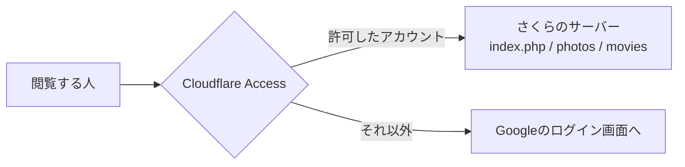

# Googleアカウントで閲覧できる人を限定する

このツールを、あらかじめ決めておいたGoogleアカウントの人だけが開けるようにする方法です。

Cloudflare の **Cloudflare Access**（Zero Trust）をサーバーの手前に置いて、
そこで認証を済ませてもらう形をとります。ツール本体のPHPには手を入れません。

- 無料の範囲（50ユーザーまで）で使えます
- 独自ドメインで運用していることが条件です
- 作業時間の目安は1時間ほど。うちDNSの反映待ちが大半です

> **この文書は手順書です。** 実際の設定作業はまだ行っていません。
> 手順5の `.htaccess` だけはツール側のファイルを書き換える必要があるので、
> 進めるときに反映してください。

## 目次

- [なぜこの方法をとるか](#なぜこの方法をとるか)
- [全体の流れ](#全体の流れ)
- [はじめる前に](#はじめる前に)
- [手順1 : ドメインを Cloudflare に載せる](#手順1--ドメインを-cloudflare-に載せる)
- [手順2 : SSL を設定する](#手順2--ssl-を設定する)
- [手順3 : Google を認証先として登録する](#手順3--google-を認証先として登録する)
- [手順4 : 保護するURLと、通す人を決める](#手順4--保護するurlと通す人を決める)
- [手順5 : 裏口を塞ぐ（重要）](#手順5--裏口を塞ぐ重要)
- [手順6 : 動作を確かめる](#手順6--動作を確かめる)
- [任意 : ログイン中のアカウントを画面に出す](#任意--ログイン中のアカウントを画面に出す)
- [うまくいかないとき](#うまくいかないとき)
- [知っておいてほしいこと](#知っておいてほしいこと)
- [付録 : PHPに認証を自前で組み込む案](#付録--phpに認証を自前で組み込む案)

## なぜこの方法をとるか

このツールは、写真・動画のファイルを `photos/` `movies/` に置いて、
ブラウザから**直接URLで**読み込ませています。PHPを通っていません。

```
ブラウザ ──> index.php  （PHP。一覧の画面を組み立てる）
        └──> photos/2024/IMG_0001.jpg  （PHPを通らない。ただのファイル）
```

そのため、PHPの中にログイン処理を書き足しても、写真そのものは守れません。
URLさえ知っていれば誰でも開けてしまいます。

きちんと守ろうとすると、写真の配信もPHPを経由させる作りに変える必要があり、
動画のシーク（再生位置の移動）に必要な Range リクエストの処理まで
自分で書くことになります。作業量が大きいわりに、表示は今より遅くなります。

Cloudflare Access はサーバーの手前に立つので、PHPもファイルも区別なく、
まとめて後ろに隠せます。今回これを選んだのはそのためです。



## 全体の流れ

| | やること | 作業する場所 |
|---|---|---|
| 手順1 | ドメインを Cloudflare に載せる | Cloudflare / さくらの会員メニュー |
| 手順2 | SSL を設定する | Cloudflare |
| 手順3 | Google を認証先として登録する | Google Cloud Console / Cloudflare |
| 手順4 | 保護するURLと、通す人を決める | Cloudflare Zero Trust |
| 手順5 | 裏口を塞ぐ | `.htaccess`（このツール） |
| 手順6 | 動作を確かめる | ブラウザ |

## はじめる前に

用意しておくもの、確認しておくことです。

- **独自ドメイン**。`pote2.sakura.ne.jp` のような、さくらから割り当てられた
  ドメインでは Cloudflare に載せられません
- **Cloudflare のアカウント**（無料で作れます）
- **Google アカウント**。認証の入口を作るのに使います
- **許可したい人のメールアドレス**。Googleアカウントのものである必要があります

そして、いちばん大事な確認です。

> **そのドメインでメールを送受信していませんか。**
>
> 手順1でネームサーバーを Cloudflare に変えると、DNSの設定は
> Cloudflare 側のものに切り替わります。メール用の MX レコードを
> 移し忘れると、**そのドメイン宛のメールが届かなくなります**。
>
> Cloudflare はドメインを追加するときに既存のDNSレコードを読み取って
> 引き継ごうとしますが、取りこぼすことがあります。手順1の途中で
> 必ず自分の目で確かめてください。確認箇所は手順1の中に書いています。

## 手順1 : ドメインを Cloudflare に載せる

### 1-1. Cloudflare にドメインを追加する

1. [Cloudflare](https://dash.cloudflare.com/) にログインする
2. **Add a domain** から、使っているドメイン（例 `example.com`）を入れる
3. プランは **Free** を選ぶ
4. Cloudflare が今のDNSレコードを読み取って一覧にする

### 1-2. DNSレコードを確かめる（ここが山場）

読み取られた一覧を、さくらの会員メニューにある今のDNS設定と見比べます。
とくに次のものが**抜けていないか**を確認してください。

| 種類 | 何のためのものか | 抜けたときに起きること |
|---|---|---|
| `MX` | メールの宛先 | **メールが届かなくなる** |
| `TXT`（SPF / DKIM / DMARC） | 送ったメールが本物だと示す | 送ったメールが迷惑メール扱いされる |
| `A` / `CNAME`（`www` など） | サイトの場所 | サイトが開かなくなる |
| `CNAME`（`_domainkey` など） | 各種サービスの所有確認 | 連携しているサービスが切れる |

足りないものは、この画面で手で足しておきます。

**プロキシの設定**（オレンジ色の雲のアイコン）は次のようにします。

- このツールを置いているホスト名（例 `media.example.com`）… **プロキシ有効（オレンジの雲）**
- `MX` レコードが指すホスト名 … **プロキシ無効（グレーの雲）**
- その他のメール関連 … **プロキシ無効（グレーの雲）**

メール系をオレンジにするとメールが止まります。ここは間違えないでください。

### 1-3. ネームサーバーを変更する

Cloudflare が2つのネームサーバー（`xxx.ns.cloudflare.com` のような形）を表示します。
これをさくら側に登録します。

1. [さくらインターネット会員メニュー](https://secure.sakura.ad.jp/) にログイン
2. **契約情報** → **契約ドメインの確認** から対象のドメインを選ぶ
3. **ネームサーバの変更** を開く
4. もともと入っている `NS1.DNS.NE.JP` `NS2.DNS.NE.JP` を消す
5. Cloudflare に表示された2つを、ネームサーバ1・ネームサーバ2に入れる
6. 保存する

登録したら Cloudflare の画面に戻り、**Check nameservers** を押します。

反映には数分から48時間かかります。たいていは1時間以内です。
`Active` になるまで待ちます。

反映されたかどうかは、手元のターミナルからも見られます。

```
dig NS example.com +short
```

`ns.cloudflare.com` を含む結果が返れば切り替わっています。

## 手順2 : SSL を設定する

Cloudflare の **SSL/TLS** → **Overview** で、暗号化モードを選びます。

- さくらの無料SSL（Let's Encrypt）を有効にしている → **Full (strict)**
- 有効にしていない → まず[さくらの無料SSLを有効にして](https://help.sakura.ad.jp/206053711/)から **Full (strict)**

> **Flexible は選ばないでください。**
> Cloudflare とサーバーの間が暗号化されないうえ、
> このツールの `.htaccess` にHTTPSへのリダイレクトを書いている場合、
> リダイレクトが無限に繰り返されてページが開かなくなります。

あわせて **SSL/TLS** → **Edge Certificates** で
**Always Use HTTPS** を有効にしておくと、`http://` で来た人も
自動的に `https://` に回されます。

こうしておけば、このツールの `.htaccess` に書いてある
HTTPSリダイレクトの4行は、コメントアウトしたままで構いません。

## 手順3 : Google を認証先として登録する

「Googleでログイン」を成立させるための下ごしらえです。
Google Cloud Console で鍵を作り、それを Cloudflare に渡します。

### 3-1. チーム名を決める

先に Cloudflare 側のチーム名が必要です。

1. Cloudflare のサイドバーから **Zero Trust** を開く
2. 初回はチーム名（team name）を聞かれるので決める（例 `kwaka`）
3. プランは **Free** を選ぶ

決めたチーム名から、次のURLができます。手順3-3で使います。

```
https://<チーム名>.cloudflareaccess.com
```

### 3-2. Google Cloud Console でクライアントIDを作る

1. [Google Cloud Console](https://console.cloud.google.com/) を開く
2. プロジェクトを新しく作る（名前は何でも構いません。例 `media-library-auth`）
3. **APIs & Services** → **OAuth consent screen** を開く
4. **Get started** を押し、アプリ名とサポート用のメールアドレスを入れる
5. Audience Type は **External** を選ぶ
6. 連絡先メールアドレスを入れて **Continue** → **Create**

続けて鍵を作ります。

7. **APIs & Services** → **Credentials** を開く
8. **Create Credentials** → **OAuth client ID**
9. Application type は **Web application**
10. **Authorized JavaScript origins** に次を入れる

    ```
    https://<チーム名>.cloudflareaccess.com
    ```

11. **Authorized redirect URIs** に次を入れる

    ```
    https://<チーム名>.cloudflareaccess.com/cdn-cgi/access/callback
    ```

12. **Create** を押すと、**クライアントID** と **クライアントシークレット** が出る

この2つは次で使います。シークレットは他人に見せないでください。
画面を閉じても、後から同じ場所で確認できます。

> 一般のGoogleアカウント（`@gmail.com` など）を使う場合、
> OAuth同意画面は「テスト」状態のままでも構いません。
> ただしテスト状態だと、Test users に登録した人しかログインできず、
> 有効期限も短くなります。継続して使うなら **Publish app**（本番公開）に
> しておくほうが手間がありません。外部に公開されるのはアプリ名だけで、
> 誰でも入れるようになるわけではありません。誰を通すかは手順4で決めます。

### 3-3. Cloudflare に登録する

1. **Zero Trust** → **Integrations** → **Identity providers**
2. **Add new identity provider** を押す
3. **Google** を選ぶ

    - Google Workspace をお使いで、組織のアカウント全体を対象にしたい場合は
      **Google Workspace** のほうを選びます。今回は個人のGoogleアカウントを
      想定して **Google** で説明します

4. さきほどのクライアントIDとクライアントシークレットを貼る
5. **Save** を押す
6. **Test** を押して、自分のGoogleアカウントでログインできることを確かめる

ここで失敗する場合、たいていはリダイレクトURIの打ち間違いです。
Google Cloud Console 側の綴りをもう一度見てください。

## 手順4 : 保護するURLと、通す人を決める

### 4-1. アプリケーションを作る

1. **Zero Trust** → **Access controls** → **Applications**
2. **Create new application** を押す
3. **Self-hosted and private** を選ぶ
4. **Add public hostname** を選ぶ
5. 保護する場所を指定する

    | 項目 | 入れるもの（例） |
    |---|---|
    | Subdomain | `media` |
    | Domain | `example.com` |
    | Path | （このツールがドメイン直下なら空欄） |

    サブディレクトリに置いている場合（例 `https://example.com/gallery/`）は、
    Path に `gallery` と入れます。

6. **Session Duration** を決める。既定は24時間です。
   毎日使うなら1週間や1か月にすると、ログインを求められる回数が減ります

### 4-2. 誰を通すかを決める

**Access policies** で **Create new policy** を押します。

1. ポリシー名を決める（例 `家族だけ`）
2. Action は **Allow**
3. ルールを次のように作る

    **決まった人だけ通す場合**

    | Action | Rule type | Selector | Value |
    |---|---|---|---|
    | Allow | Include | Emails | `you@gmail.com` |
    | Allow | Include | Emails | `family@gmail.com` |

    Value は続けて何件でも足せます。

    **ドメイン単位で通す場合**（Google Workspace 向け）

    | Action | Rule type | Selector | Value |
    |---|---|---|---|
    | Allow | Include | Emails ending in | `@example.com` |

    **両方を混ぜる場合**

    Include に並べたものは「どれかに当てはまれば通す」という扱いです。
    社内ドメイン全員と、外部の協力者数名、という指定ができます。

4. 保存して、アプリケーションに割り当てる

ポリシーを1つも作らないと**すべて拒否**になります。
逆に言えば、書き忘れて誰でも入れる状態になることはありません。

### 4-3. 認証先を絞る

アプリケーションの設定画面で、identity providers から
**Google** だけを選んでおきます。

こうしないと、ワンタイムPIN（メールに届く数字）でも入れる状態になります。
「Googleアカウントで認証されたユーザーだけ」という条件にするなら、
ここは絞っておいてください。

**Apply instant authentication** を有効にすると、
「どの方法でログインしますか」という選択画面が省かれ、
いきなりGoogleのログイン画面に飛びます。認証先が1つだけなら
有効にしておくほうが親切です。

## 手順5 : 裏口を塞ぐ（重要）

**ここを飛ばすと、ここまでの設定がほぼ意味を失います。**

Cloudflare Access が守れるのは「Cloudflare を通ってきたリクエスト」だけです。
ところが、さくらのレンタルサーバーは独自ドメインとは別に、
はじめから割り当てられているドメインでも同じ場所に届いてしまいます。

```
https://media.example.com/          ──> Cloudflare を通る ──> 認証あり
https://pote2.sakura.ne.jp/gallery/ ──> Cloudflare を通らない ──> 素通り
```

サーバーのIPアドレスを直接叩かれた場合も同じです。
この2つを `.htaccess` で塞ぎます。

### 塞ぎ方

このツールの `.htaccess` に、次の2つを足します。
`.htaccess` は `.htaccess.example` をコピーして作るものなので、
**両方に同じ内容を入れておく**と、次にサーバーを移すときに困りません。

```apache
# ---------------------------------------------------------------
# Cloudflare Access を通らないアクセスを拒否する
#
# Cloudflare Access は「Cloudflare を通ったリクエスト」しか守れない。
# さくらの初期ドメインやサーバーのIPを直接叩かれると素通りしてしまうため、
# ここで入口を独自ドメイン＋Cloudflare経由だけに絞る。
# ---------------------------------------------------------------

# (1) 独自ドメイン以外のホスト名で来たものを拒否する
#     media.example.com の部分は、実際に使っているホスト名に書き換えること。
<IfModule mod_rewrite.c>
    RewriteEngine On
    RewriteCond %{HTTP_HOST} !^media\.example\.com$ [NC]
    RewriteRule ^ - [F,L]
</IfModule>

# (2) Cloudflare のIPアドレス以外から来たものを拒否する
#     ホスト名は偽装できるので、こちらが本命の守り。
#     一覧は https://www.cloudflare.com/ips/ で公開されている。
#     年に数回更新されるため、つながらなくなったときは確認すること。
<IfModule mod_authz_core.c>
    <RequireAny>
        # IPv4
        Require ip 173.245.48.0/20
        Require ip 103.21.244.0/22
        Require ip 103.22.200.0/22
        Require ip 103.31.4.0/22
        Require ip 141.101.64.0/18
        Require ip 108.162.192.0/18
        Require ip 190.93.240.0/20
        Require ip 188.114.96.0/20
        Require ip 197.234.240.0/22
        Require ip 198.41.128.0/17
        Require ip 162.158.0.0/15
        Require ip 104.16.0.0/13
        Require ip 104.24.0.0/14
        Require ip 172.64.0.0/13
        Require ip 131.0.72.0/22
        # IPv6
        Require ip 2400:cb00::/32
        Require ip 2606:4700::/32
        Require ip 2803:f800::/32
        Require ip 2405:b500::/32
        Require ip 2405:8100::/32
        Require ip 2a06:98c0::/29
        Require ip 2c0f:f248::/32
    </RequireAny>
</IfModule>
```

上のIPアドレス一覧は2026年8月時点のものです。
最新の一覧は次のコマンドで取れます。

```
curl -s https://www.cloudflare.com/ips-v4; echo; curl -s https://www.cloudflare.com/ips-v6
```

### Basic認証はどうするか

Cloudflare Access が入れば、`.htaccess` の Basic認証は要りません。
`AuthType Basic` から `Require valid-user` までの4行はコメントアウトして構いません。

両方有効にしておくこともできますが、閲覧するたびに
Basic認証のダイアログとGoogleログインの2回を通ることになります。

`.htpasswd` と `make-htpasswd.php` は、Cloudflare を使わない場所に
置き直すときのために残しておくとよいでしょう。

## 手順6 : 動作を確かめる

順番に見ていきます。

**1. 許可したアカウントで入れるか**

シークレットウィンドウで `https://media.example.com/` を開きます。
Googleのログイン画面が出て、許可したアカウントでログインすると
一覧が表示されれば成功です。

**2. 許可していないアカウントが弾かれるか**

別のGoogleアカウントでログインしてみます。
「You do not have permission」のような画面が出れば成功です。

**3. 写真そのものも守られているか**

ログアウトした状態（別のシークレットウィンドウ）で、
写真のURLを直接開いてみます。

```
https://media.example.com/photos/2024/IMG_0001.jpg
```

ログイン画面に飛べば成功です。写真が表示されてしまったら、
手順4のPath指定を見直してください。

**4. 裏口が塞がっているか**

```
curl -I https://pote2.sakura.ne.jp/gallery/
```

`403 Forbidden` が返れば成功です。`200 OK` が返ったら手順5ができていません。

**5. 動画が再生できるか、シークできるか**

動画を開いて、再生バーの途中をクリックしてみます。
そこから再生が続けば問題ありません。

**6. ドラッグ&ドロップで取り込めるか**

大きめの動画ファイルを落としてみます。
このツールは4MBずつに分けて送るので、Cloudflare 無料プランの
100MB制限には当たりません。

## 任意 : ログイン中のアカウントを画面に出す

Cloudflare Access は、認証を通したリクエストに
ログインした人のメールアドレスを添えてサーバーへ渡します。
これを読めば、画面に「誰として見ているか」を出せます。

**この機能は手順5が済んでいることが前提です。**
Cloudflare を通らないアクセスを拒否していないと、
このヘッダは偽装できてしまいます。

`index.php` のヘッダー部分に、次のようなものを足す想定です。

```php
// Cloudflare Access が渡してくるログイン中のメールアドレス。
// このヘッダを信用してよいのは、.htaccess で Cloudflare 経由以外の
// アクセスを拒否しているため（→ docs/google-auth.md の手順5）。
$loginEmail = (string) ($_SERVER['HTTP_CF_ACCESS_AUTHENTICATED_USER_EMAIL'] ?? '');
```

```php
<?php if ($loginEmail !== ''): ?>
    <span class="login-user"><?= h($loginEmail) ?></span>
    <a class="login-logout" href="/cdn-cgi/access/logout">ログアウト</a>
<?php endif; ?>
```

`/cdn-cgi/access/logout` は Cloudflare が用意しているURLです。
このツール側で用意する必要はありません。

> より厳密にやるなら、`Cf-Access-Jwt-Assertion` ヘッダに入っている
> JWT を検証します。公開鍵は
> `https://<チーム名>.cloudflareaccess.com/cdn-cgi/access/certs` から取れ、
> アプリケーションごとの **Application Audience (AUD) Tag**
> （Zero Trust → Access controls → Applications → Configure →
> Additional settings で確認できます）と照合します。
>
> ただしこれはPHPでのRS256署名検証を自前で書くことになり、
> 手順5を済ませていれば得られるものはほとんどありません。
> 今回は必要ないと判断しています。

## うまくいかないとき

**ページが開かず、リダイレクトが繰り返される**

SSLモードが Flexible になっています。手順2に戻って **Full (strict)** にしてください。

**526 Invalid SSL certificate が出る**

Full (strict) にしたのに、さくら側の無料SSLが有効になっていません。
さくらのコントロールパネルで証明書を発行してください。
急ぐ場合は一時的に **Full**（strict なし）にすると通ります。

**Googleのログイン画面で redirect_uri_mismatch と出る**

Google Cloud Console に登録したリダイレクトURIが違っています。
末尾の `/cdn-cgi/access/callback` まで含めて、
チーム名の綴りも含めて見比べてください。

**ログインはできるのに「permission がない」と言われる**

手順4-2のポリシーにそのメールアドレスが入っていません。
Googleアカウントのメールアドレスと、ポリシーに書いたものが
一致しているか確かめてください（別名のアドレスだと一致しません）。

**自分も 403 で入れなくなった**

手順5のIP制限が効きすぎています。
Cloudflare のDNS設定で、そのホスト名のプロキシがオレンジの雲に
なっているか確かめてください。グレーだと Cloudflare を経由しないため、
自分のIPから直接届いて拒否されます。

**アクセスログのIPアドレスが全部 Cloudflare のものになった**

仕様です。本来のIPアドレスは `CF-Connecting-IP` ヘッダに入っています。

**メールが届かなくなった**

手順1-2の MX レコードを取りこぼしています。
Cloudflare のDNS画面で MX レコードを確認し、
足りなければ足してください。またグレーの雲になっているかも確認してください。

## 知っておいてほしいこと

**Cloudflare の利用規約について**

Cloudflare の利用規約 Section 2.8 は、動画など大きなファイルを
CDN で大量に配信することを制限しています。
個人や家族で写真・動画を見る規模であれば、まず問題になりません。
不特定多数に向けた動画配信に育てる場合は、規約を読み直してください。

**無料プランの制限**

| | 制限 | このツールへの影響 |
|---|---|---|
| Access のユーザー数 | 50人まで | 通常は足ります |
| アップロード1回あたり | 100MB | 4MBずつ送るので影響なし |
| セッション | 既定24時間 | 手順4-1で延ばせます |

**外部サービスに依存することについて**

この方法は Cloudflare が動いていることが前提です。
Cloudflare に障害が起きると、このツールも開けなくなります。
また、無料プランの条件が将来変わる可能性もあります。

そうなったときは、次の付録の方法に切り替えることになります。

## 付録 : PHPに認証を自前で組み込む案

Cloudflare を使わない場合、あるいは将来やめる場合の設計メモです。
**今回は採用していません。** 必要になったときの下敷きとして残します。

### 必要になるもの

| ファイル | 役割 |
|---|---|
| `auth-config.php` | クライアントIDなどの設定。Git管理から外す（`.gitignore` へ） |
| `auth-config.php.example` | その見本。リポジトリに入れる |
| `lib/auth.php` | OAuth 2.0 のフロー、許可アカウントの判定 |
| `login.php` | ログイン画面、Googleからの戻り先、ログアウト |
| `media.php` | **写真・動画の配信をPHP経由にする**。ここが最大の作業 |

### 手をつける必要がある既存のコード

- `lib/functions.php` の `pv_image_url()` … `media.php` 経由のURLを返すように変える
- `index.php` … 先頭で認証を必須にする
- `action.php` … 未ログインならエラーにして戻す
- `upload.php` … 未ログインなら JSON で 401 を返す
- `photos/.htaccess` `movies/.htaccess` … 直接アクセスを全面的に禁止する
- `config.php` … 各ルートの `url` は使わなくなる

### `media.php` で必要になる処理

- パスを `realpath` で解決し、ルートの外を指していないか確かめる
- 拡張子がそのルートの `extensions` に含まれるか確かめる
- `Content-Type` を返す
- **`Range` リクエストへの対応**。これがないと動画のシークができない
- `Last-Modified` / `ETag` / `304 Not Modified`
- `Cache-Control: private`

### ID トークンの扱い

認可コードをサーバー側でトークンと交換する形（authorization code flow）なら、
`id_token` は Google から TLS 越しに直接受け取ったものになります。
この場合、署名検証は省いて `iss` / `aud` / `exp` / `nonce` / `email_verified`
の確認だけでよい、と OpenID Connect Core 3.1.3.7 が認めています。

外部ライブラリなしで書けるのはこのためです。
署名検証まで自前でやるなら `firebase/php-jwt` を入れるのが早道ですが、
Composer と `vendor/` の転送が増えます。

### この方法の弱点

- 写真60枚の一覧で、PHPのプロセスが60本走る。共有サーバーでは詰まりやすい
- 現状はサムネイルを作らずフルサイズの画像を並べているため、
  PHP経由にすると初回表示がはっきり遅くなる
  （`media.php` を作るなら、同時にサムネイル生成を入れるのが自然）
- 許可アカウントを変えるたびにファイルを編集してデプロイする必要がある

---

**参考にした資料**

- [Cloudflare Zero Trust : Self-hosted アプリケーションの設定](https://developers.cloudflare.com/cloudflare-one/applications/configure-apps/self-hosted-public-app/)
- [Cloudflare Zero Trust : Google を IdP にする](https://developers.cloudflare.com/cloudflare-one/integrations/identity-providers/google/)
- [Cloudflare Zero Trust : ポリシーの書き方](https://developers.cloudflare.com/cloudflare-one/access-controls/policies/)
- [Cloudflare : IPアドレス一覧](https://www.cloudflare.com/ips/)
- [さくらインターネット : 無料SSLの設定](https://help.sakura.ad.jp/206053711/)
